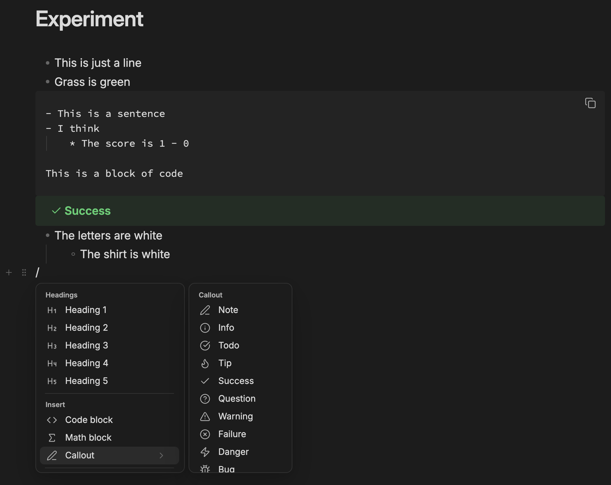

# Feel the Notion

> Recommended plugin to enhance experience: [Bullet depth markers](https://community.obsidian.md/plugins/bullet-depth-markers)
>
> Recommended setting: Obsidian Settings → Files and Links → under Links, toggle on **Automatically update internal links**.

Notion-like block editing for Obsidian's Live Preview.

## Features

- **Hover handles** — a `+` and a drag handle follow the pointer down the gutter.
- **Drag whole blocks** — grabbing any line takes the block, children included, and drops it at a depth you choose with horizontal position.
- **Multi-block selection** — a drag across blocks paints whole blocks rather than a ragged text range.
- **Block-aware keys** — `Cmd+A` selects the block, then the note. `Backspace` at a block's start outdents, then drops the marker, then merges.
- **Insert menu** — type `/` on an empty block or mid-line, or click the `+`.
- **Hide syntax markers** — optional: stops text shifting sideways as the caret enters `**bold**`.
- **Handle side** — the handle can sit on the left or the right of the text, and can be pinned so it never hides when the pointer moves away.
- **Fold blocks** — a chevron on the handle folds a block to its first line, leaving an ellipsis you click to expand it again.
- **Move blocks together** — selecting several blocks and dragging any one of their handles moves all of them together.
- **Custom insert menu** — insert-menu rows can be reordered, hidden, and extended with custom rows that run any Obsidian command. A custom row runs its command on a single click with no confirmation, so binding a destructive one — "Delete current file", say — gives you a one-click delete.

Everything behavioural has a toggle in settings.

<b>Change logs</b>

### 0.6.0

Bug fixes and improvements:

- The drag handle no longer disappears while you reach for it.
- The settings page no longer jumps back to the top when you add, edit, reorder or delete an insert menu row.
- Custom insert menu rows can now bind any Obsidian or plugin command, not just the handful that were listed.

### 0.5.0

Bug fixes and improvements.

New features:

- Handle position and always-on pinning
- Block folding from the handle
- Multi-block drag
- Insert menu reordering, hiding and custom commands

### 0.4.0

Bug fixes and improvements:

- Dragging blocks is smoother. Pointer movement is now handled once per frame rather than once per mouse event, so a fast drag no longer does the same measuring several times between two redraws.
- Hovering the gutter costs less. The handle measures the line only when the pointer actually crosses into a different one, instead of re-checking on every movement.
- Measuring and repositioning were interleaved, which forced the browser to recalculate layout repeatedly within a single mouse event. Everything is now measured first and drawn afterwards.
- Editor geometry that cannot change mid-drag is read once instead of on every movement, and the list of legal drop depths is recalculated only when the drop point moves to a different line.
- Releasing the mouse at the end of a fast drag drops the block where the pointer actually was, not where it had been a moment earlier.
- The hover handle no longer occasionally stays on screen after the pointer has left the editor.

### 0.3.0

**Mobile support coming!**

New:

- `/check list` — inserts a `- [ ]` checkbox.
- `/yesterday` and `/tomorrow` — insert the neighbouring day's date.

Bug fixes and improvements:

- Hide syntax markers now leaves code alone. `_VARIABLE_A_` inside a fenced block or an inline code span keeps its underscores.
- Typing `/table` now offers Table before Table of contents.
- A table inserted directly under text gets the blank line Markdown needs, so it renders as a table instead of literal pipes.
- The caret now lands in the new table's first cell.

## Installation

### Community plugins

1. Settings → Community plugins → **Browse**.
2. Search for **Feel the Notion**, then **Install**.
3. **Enable** it.

### Manual

1. Download `main.js`, `manifest.json` and `styles.css` from the [latest release](https://github.com/MichaelNguyen5653/feel-the-notion/releases).
2. Put them in `<vault>/.obsidian/plugins/feel-the-notion/`.
3. Enable the plugin in Settings → Community plugins.

## Credits

Forked from [BCS1037/notion-block](https://github.com/BCS1037/notion-block) v1.4.0 (MIT).

Built with the help of [Claude Code](https://claude.com/claude-code).

## License

MIT. See [LICENSE](LICENSE).
